# AI Sports Coach Motion Control

Build a reusable sports-motion library with one consistent AI digital-human coach, then turn approved clips into a timed course with voice guidance.

把真人动作参考变成统一形象的 AI 数字人运动教练，再把通过 QA 的动作、课程时间轴和语音指导装成一节可以直接跟练的课。

This repository packages the real Da-Yul production workflow as a small Codex Skill plus deterministic helper scripts. Kling Motion Control is operated through the official browser workspace; this project does not present it as an API.

## Why this repository exists

For a sports-training product, the expensive part is often not the player UI. It is producing a large, consistent action library.

| Production route | What works | What becomes a bottleneck |
| --- | --- | --- |
| Shoot every action with a human coach | Direct control over coaching and production | Every new action repeats coach/model, scheduling, studio, lighting, camera, editing, and voice cost |
| Reuse public training videos directly | A huge supply of useful motion references | Backgrounds, coaches, clothing, aspect ratios, captions, noise, brand style, provenance, and rights are inconsistent |
| Motion reference + fixed digital coach | Human motion remains the trajectory reference; delivery becomes visually consistent | Still requires source records, paid generation, human QA, and provider/rights review |

The goal is not to remove the human reference or let a prompt invent sports technique. The goal is to separate responsibilities:

- the reference video carries the motion;
- the Character Bible carries identity, proportions, clothing, and framing;
- Kling Motion Control combines them;
- human QA decides whether the complete trajectory is safe and usable;
- ActionLib, the course timeline, and timed voice cues turn a clip into reusable product content.

## Verified Da-Yul build

The current implementation has produced:

- **21 approved motion clips**: 4 warm-up, 11 tennis-specific, and 6 cooldown;
- **20 actions** assembled into one **10:35** follow-along course;
- **42 course steps**, including preparation and transitions;
- **198 timed voice events** and **418 sound-effect events**;
- deterministic runtime playback with AI clip → authorized human clip → static card fallback.

This is a working browser-based follow-along prototype. It is not yet a complete iOS integration, and the evidence here does not claim that every generated frame exactly matches the reference.

## See the result first

Click any frame to open the repository-hosted MP4.

| Tennis motion reproduction | Warm-up motion reproduction |
| --- | --- |
| [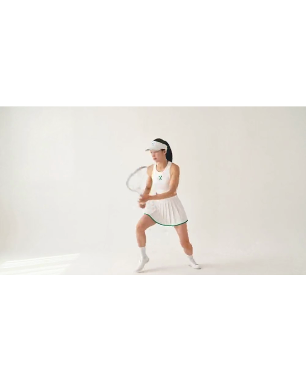](examples/media/dayul-motion-output.mp4) | [](examples/media/dayul-lunge-warmup.mp4) |
| Split-step + forehand; representative high-risk racket action | Lunge rotation; proves the pipeline is not limited to one tennis stroke |

| 10:35 course orchestration | Timed voice coaching |
| --- | --- |
| [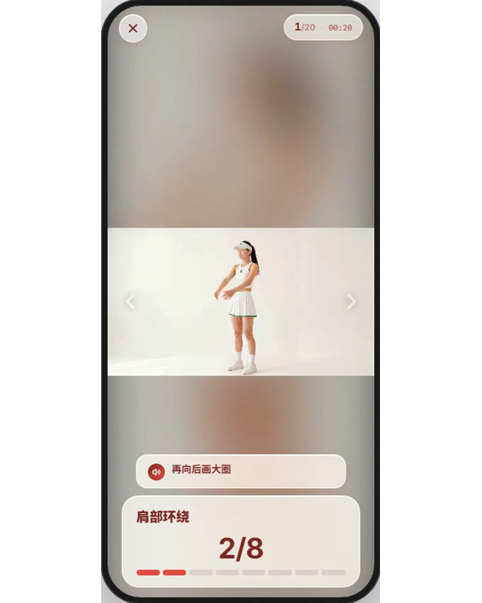](examples/media/dayul-course-orchestration.mp4) | [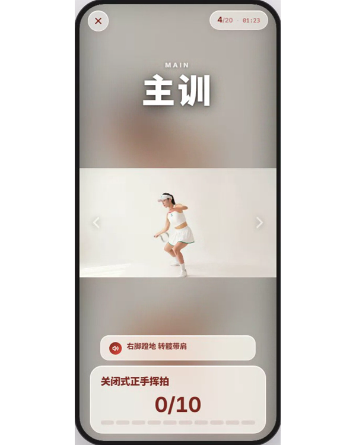](examples/media/dayul-timed-voice-coaching.mp4) |
| 20 actions across warm-up, main training, and cooldown | Technique, correction, countdown, encouragement, and transitions on the course timeline |

### Human reference vs. Da-Yul output

[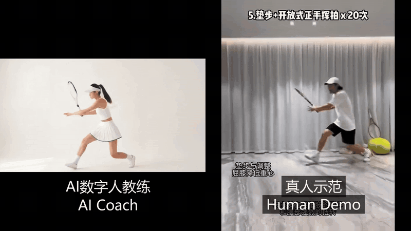](examples/media/dayul-vs-human-side-by-side.mp4)

The GIF plays directly in the README; click it to open the full MP4. The human reference performer is the repository owner and explicitly authorized public redistribution of this comparison on 2026-08-15. One representative pair is included; duplicate label variants of the same motion are intentionally omitted.

Published context: [Da-Yul demo 04 on X](https://x.com/ZhenZhu200/status/2087578938252087616).

## Quick start

Clone the repository:

```bash
git clone https://github.com/zhenzoo/ai-sports-coach-motion-control.git
cd ai-sports-coach-motion-control
```

Copy `skills/ai-sports-coach` into your agent's skills directory, or point the agent directly at the skill in this repository. Initialize a project:

```bash
python skills/ai-sports-coach/scripts/init_project.py --project-root my-coach
```

Add your own authorized character and motion assets under `my-coach/inputs/`, then ask your agent:

```text
Use $ai-sports-coach to inspect my project, prepare Kling Motion Control generation packets, and stop before any paid generation.
```

Run the deterministic checks:

```bash
python skills/ai-sports-coach/scripts/preflight_assets.py --project-root my-coach
python skills/ai-sports-coach/scripts/build_generation_packets.py --project-root my-coach
```

Only after reviewing the packets, open the official Kling Motion Control workspace:

https://kling.ai/app/video-motion-control/new

The workspace and observed flow were verified on 2026-08-15. Provider UI, credits, limits, and model availability can change.

## End-to-end production line

```text
course + action list
  -> source ledger + one-action clips
  -> Character Bible
  -> Kling 3.0 Motion Control
  -> human QA
  -> ActionLib
  -> course timeline
  -> timed voice coaching + deterministic player
```

The Skill prepares one generation packet per action and enforces one important gate: prove one representative high-risk action end to end before preparing a batch.

## Visual walkthrough

### 1. Build a Character Bible, not one attractive portrait

Different assets anchor different failure modes. Turnaround and head views stabilize identity during direction changes; T-pose fixes body proportions; outfit details keep clothing, materials, and small design elements consistent.

| Turnaround views | T-pose and proportions |
| --- | --- |
| 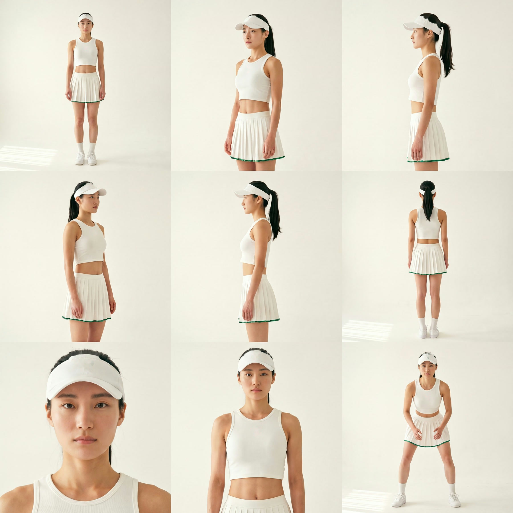 | 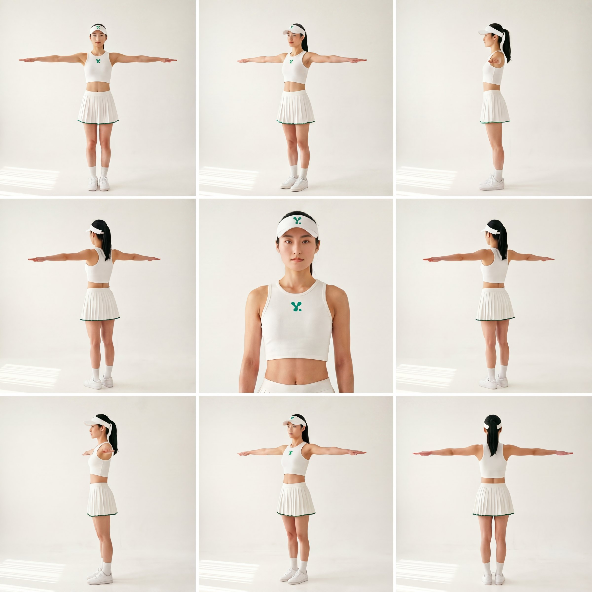 |

| Head views | Outfit details |
| --- | --- |
| 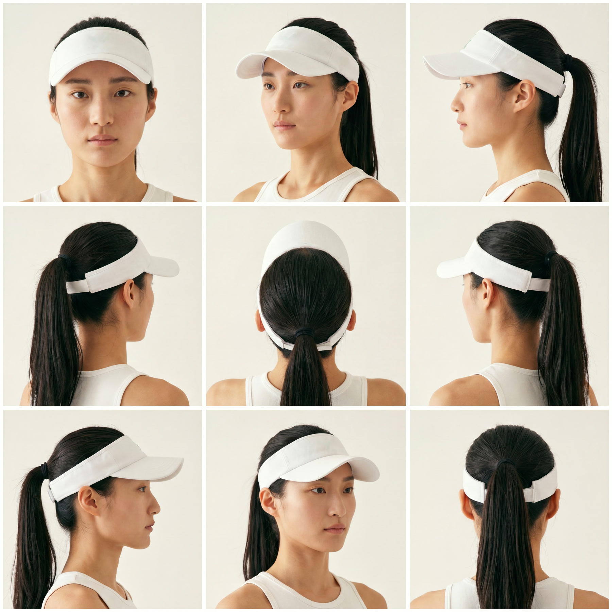 | 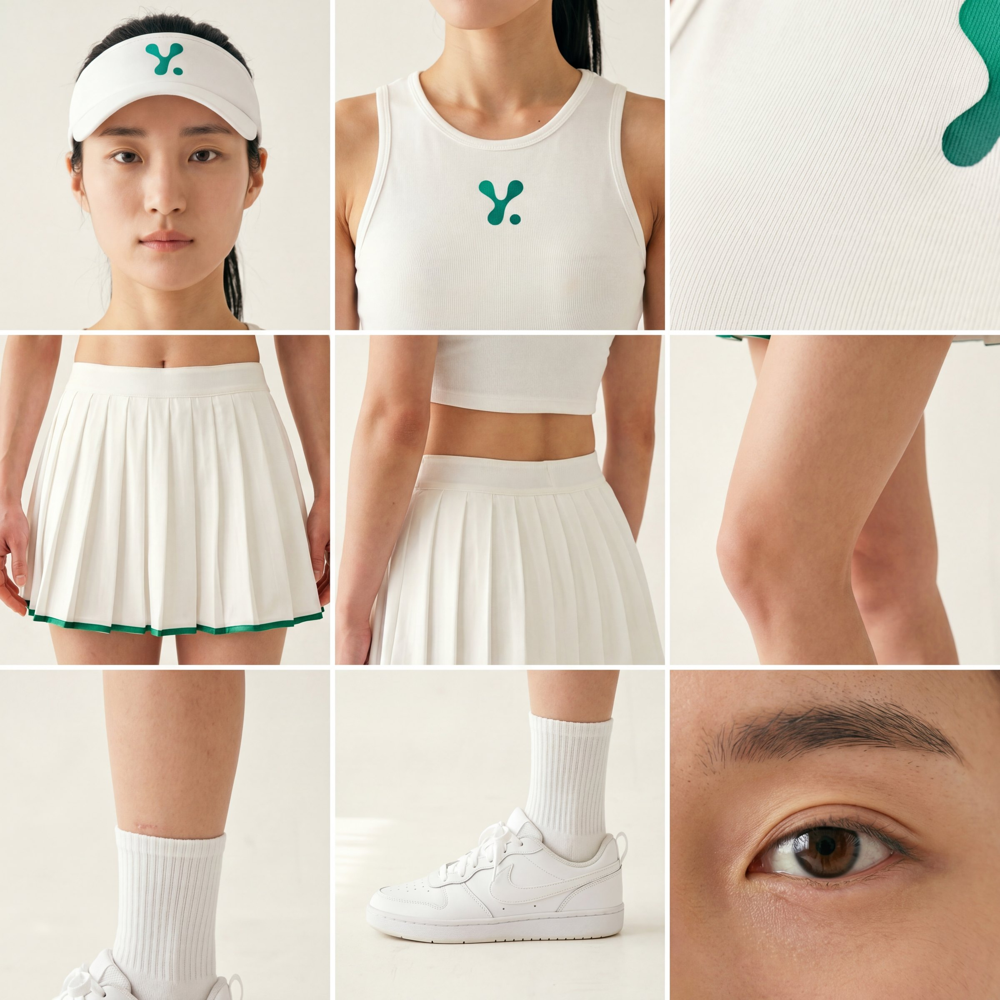 |

The reusable Character Bible prompt is in [SOP-010: Kling Motion Control](skills/ai-sports-coach/references/SOP-010-kling-motion-control.md#character-bible-prompt).

### 2. Separate motion, identity, and prompt

The Motion Control inputs have different jobs:

1. Upload one full-body, single-action reference clip.
2. Upload the character image with the closest direction and target aspect ratio.
3. Choose whether orientation follows the video or the character image.
4. Bind the authorized face subject when available.
5. Keep the prompt short: action clarification, prop, studio, camera, and exclusions.


Reference video = motion. Character image and face subject = identity. Prompt = only what those inputs do not already specify.

### 3. Review the full motion sequence

Do not approve a clip from one attractive frame. Compare preparation, weight transfer, joint trajectory, racket or prop behavior, framing, and finish. Face, proportions, and clothing must remain stable through turns and occlusion.

The complete acceptance criteria live in [TASTE-010: motion, course, and voice quality](skills/ai-sports-coach/references/TASTE-010-course-voice-qa.md).

### 4. Store actions as assets, not loose MP4 files

Each approved ActionLib entry keeps the source record, human fallback when authorized, Da-Yul output, prompt, model/mode, output mapping, player parameters, and QA status. That is what makes one movement reusable across multiple courses.

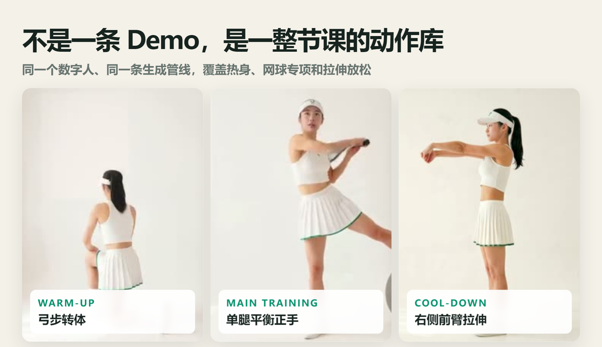

### 5. Turn the action library into a course

A course is not a playlist. It needs preparation time, phase order, side/prop transitions, real event-derived duration, and deterministic fallback behavior.

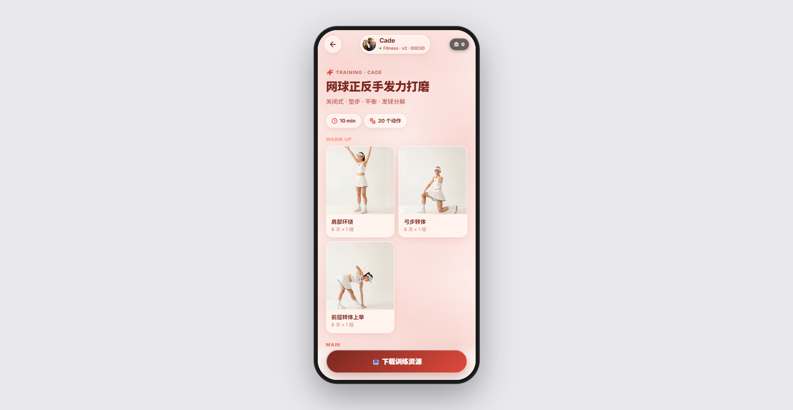

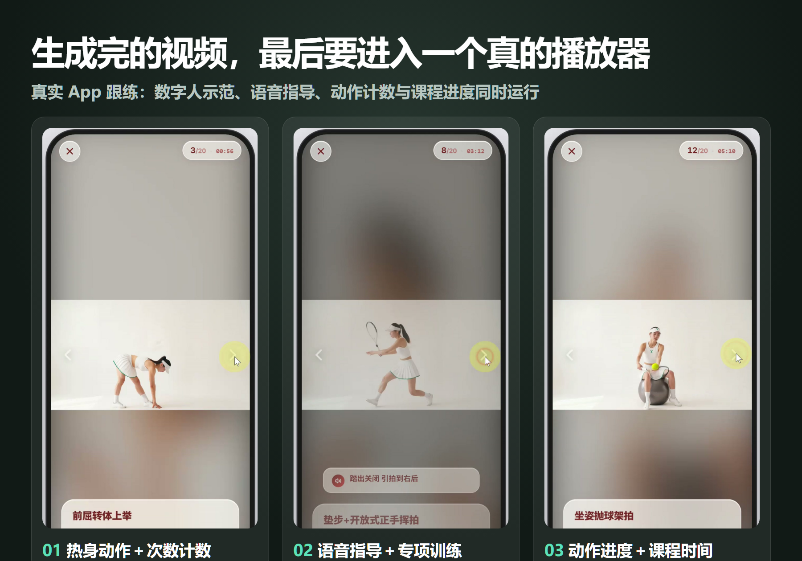

### 6. Put coaching language on the timeline

The visual demonstrates the movement; the voice carries the user through the session. Each cue should do one job at one moment: setup, technique, correction, encouragement, countdown, or transition.

| Voice content system | Voice-event orchestration |
| --- | --- |
|  | 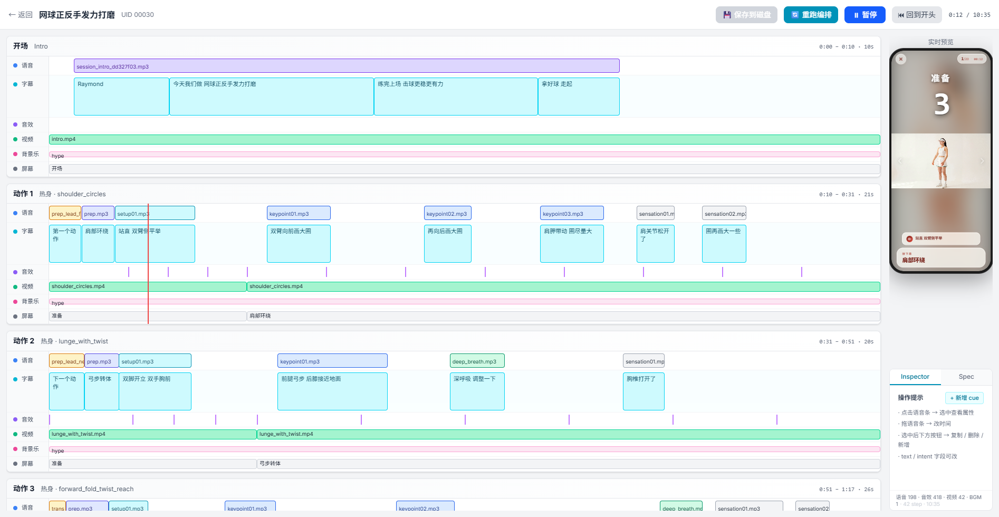 |

Motion clips, course structure, and voice cues remain separate. One cue can be rewritten or retimed without regenerating the action video.

## What the Skill fixes

- A fixed project layout for character anchors, motion sources, output clips, course manifests, and job state.
- A source ledger that separates public availability from redistribution rights.
- Short Motion Control prompts that leave motion to the video and identity to the character image.
- A one-action end-to-end proof before batch generation.
- Visual QA for body trajectory, face, clothing, hands, rackets, balls, and framing.
- Course and voice timing contracts so the result becomes a coach-led session, not a folder of MP4 files.

## Contracts and operating references

- [Skill entry](skills/ai-sports-coach/SKILL.md)
- [Project folders and JSON contracts](skills/ai-sports-coach/references/SPEC-010-project-contract.md)
- [Kling Motion Control workflow and prompt pattern](skills/ai-sports-coach/references/SOP-010-kling-motion-control.md)
- [Motion, course, and voice QA](skills/ai-sports-coach/references/TASTE-010-course-voice-qa.md)
- [Public distribution stops](skills/ai-sports-coach/references/BAN-010-public-safety.md)

## What is intentionally not here

- No Kling API wrapper: this workflow uses the official browser interface.
- No paid generation without the user's approval.
- No API keys, private portraits, cloned voices, signed URLs, or client assets.
- No promise that a public video is licensed for reuse. Record the creator, source URL or owner attestation, capture date, permission scope, and redistribution status before publication.

## Repository layout

```text
skills/ai-sports-coach/
  SKILL.md
  agents/openai.yaml
  references/
  scripts/
examples/
  images/
  media/
  media-rights.json
```

## License

Code and workflow text are released under the [MIT License](LICENSE). Example media remains subject to the rights stated in [examples/media-rights.json](examples/media-rights.json).
